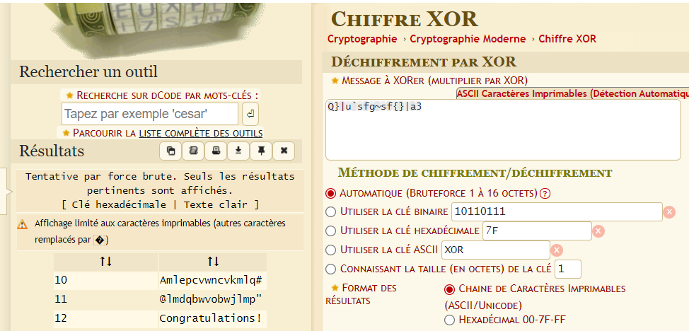

# Level 03

```
level03@OverRide:~$ ./level03
***********************************
*               level03         **
***********************************
Password:test

Invalid Password
```

Apres decompilation du programme (binary ninja + chatgpt) on apercoit que l'input prend un unsigned int en parametre et l'envoi a la fonction test.

La fonction test envoi a la fonction decrypt la difference entre le 1er parametre (0x1337d00d) et l'input.

La fonction decrypt utilise le resultat precedent et utilse un xor sur chaque char de encrypted_string.

Enfin, une comparaison est faite entre encrypted_string et "Congratulations!", si identique ouvre un shell.

Nous allons utiliser dcode.fr, utiliser le dechiffrement par xor avec comme input la string encrypted_string.



Nous comprenons que la cle que nous devons utiliser pour que encrypted_string soit identique a "Congratulations!" est 12(base 12) et donc 18 (base 10).

Il suffit de faire le calcul suivant pour retrouver le mot de passe a rentrer.

(0x1337d00d =) 322424845 - 18 = 322424827

```
level03@OverRide:~$ ./level03
***********************************
*               level03         **
***********************************
Password:322424827
$ whoami
level04
$ cat /home/users/level04/.pass
kgv3tkEb9h2mLkRsPkXRfc2mHbjMxQzvb2FrgKkf
```